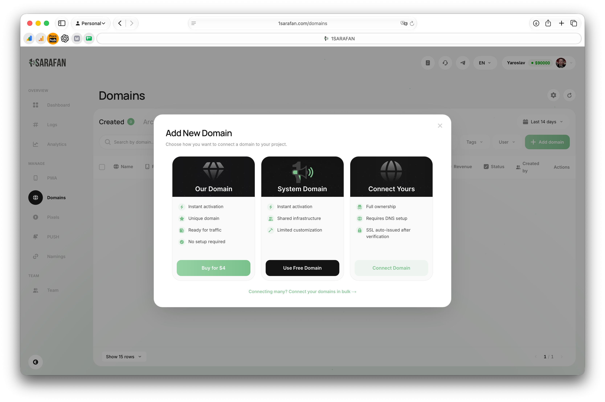

# Быстрый старт

## Шаг 1. Регистрация

Перейди на <mark style="color:blue;">1sarafan.com,</mark> введи E-mail, пароль и Telegram. Нажми **Зарегистрироваться.** Также возможна регистрация через Telegram, для этого кликни **With Telegram.**

<figure><figcaption></figcaption></figure>

## Шаг 2. Добавление домена

Перейди на вкладку **Traffic\&Routing** и нажмите кнопку **Add domain.**

<figure><figcaption></figcaption></figure>

Для работы с доменами доступно 3 варианта:

1. Покупка домена
2. Использование системного для создания поддомена
3. Подключение своего

<figure><figcaption></figcaption></figure>

Выбери желаемый вариант и следуйте инструкции.

## Шаг 3. Заполнение данных в PWA

Откройте вкладку **PWA** и нажмите **Create PWA**

<figure><figcaption></figcaption></figure>

Во вкладке **General** подключите добавленный вами домен

<figure><figcaption></figcaption></figure>

Во вкладке **Tracker укажите странну и ссылку** на оффер

<figure><figcaption></figcaption></figure>


**Важно:** Как подключить свой домен описано [здесь](setup-1sarafan/connect-domain.md). Или обращайся в [<mark style="color:blue;">поддержку 1sarafan.com</mark>](https://t.me/PWA1saravan_manager)


## Шаг 4. Оформление PWA

### Шаблоны PWA и AI

Наша команда дизайнеров регулярно разрабатывает новые шаблоны для PWA. Чтобы выбрать один из них — нажми кнопку **Шаблоны.** Ты увидишь актуальный каталог бесплатных дизайнов. Также можно сгенерировать PWA с помощью AI. Для этого нажми **Generate AI**.


**Важно:** Для корректной генерации PWA с помощью AI вернись в раздел "**Design**" и выберите язык, который AI должен использовать для генерации контента.


<figure><figcaption></figcaption></figure>

### Собственный дизайн

Всё интуитивно понятно, но есть нюансы, на которые стоит обратить внимание для корректной работы и более высокого конверта.


**Иконка приложения:** соответствие сторон для логотипа — 1:1, вес картинки — до 1-2 МБ.

Помни, что в Tier-3 гео Интернет работает медленно — долгая загрузка картинок может негативно повлиять на Click2Install.


Чем меньше вес основных картинок — тем лучше. Соотношение сторон — 16:9 или 9:16.


Все картинки должны идти друг за другом, в противном случае — ошибка генерации PWA, корректный пример ниже.


<figure><figcaption></figcaption></figure>

## Шаг 5. Комментарии

Переходим в раздел **Комментарии.** Можно генерировать их с помощью AI или вручную. Обрати внимание: во время генерации комментария с помощью AI за основу будет взят язык, выбранный в разделе **Трекер.**

<figure><figcaption></figcaption></figure>

## Шаг 6. Интеграция с вашим трекером

### Интеграция с Keitaro

Создай новый источник и заполни параметры вручную. При необходимости ты сможешь добавить другие параметры или отредактировать текущие.

Перейди в свою кампанию и выбери созданный источник — все необходимые настройки будут применены автоматически.

<figure><figcaption></figcaption></figure>

### Интеграция с Binom

Создай новый источник и укажи [https://api.1sarafan.com/v1/postbacks?subid={external\_id}\&tid={clickid}\&status={cnv\_status}\&payout={payout}\&currency=usd ](https://api.1sarafan.com/v1/postbacks?subid={external_id}\&tid={clickid}\&status={cnv_status}\&payout={payout}\&currency=usd)как **Postback Url,** проставь следующие параметры:

<figure><figcaption></figcaption></figure>

После этого выбери данный источник в своей кампании.


Как правильно настроить исходящие постбеки и макросы читай [здесь](/broken/pages/Ie8G4oplYZGhIryXG0JA).


## Шаг 7. Аналитика

👉 Больше информации о интеграции с FB, Google, Tiktok, Kwai, Bigo можно найти [здесь](/broken/pages/BoXPxoejSMNcXrEWdSHl).

В разделе **Аналитика** мы выбираем ранее созданный пиксель из выпадающего списка.

<figure><figcaption></figcaption></figure>

### 🚨 Важно! Подключение пикселя в PWA

После создания пикселя для корректной передачи ивентов нужно **обязательно** указать в ссылке PWA.\
\
К примеру: домен PWA — `horangonik.store` , ты работаешь с FB-пикселем с идентификатором `7489092067849184` . Тогда ссылка должна выглядеть следующим образом: `https://horangonik.store?fbp=7489092067849184`

Это касается и других пикселей. Вот список параметров:

```
fbp - Facebook pixel
ttp - Tiktok pixel
bgp - Bigo pixel
kwp - Kwai pixel
gcid - Google conversion id
```

## Шаг 8. Дополнительные настройки

Базово этот раздел можно пропустить: по дефолту все настройки уже выставлены для получения максимального перформанса от трафика. Но мы подготовили дополнительный материал о работе iOS и PC трафика — читай [здесь](/broken/pages/n5cdf3HOi9Qd69wjRhKk).

## 🎉 Финал. Активация PWA

После выставления настроек можно смело нажимать **Запустить.** PWA будет создана в течение 2-х минут. Если процесс занимает дольше — обратись в [саппорт](https://t.me/PWA1saravan_manager).

<figure><figcaption></figcaption></figure>

Полную ссылку для запуска приложения можно скопировать внутри PWA

<figure><figcaption></figcaption></figure>
