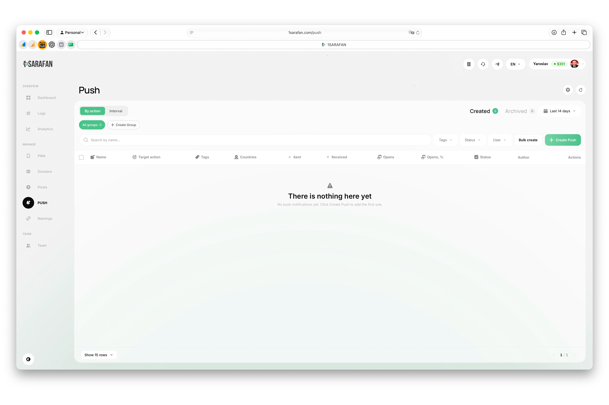
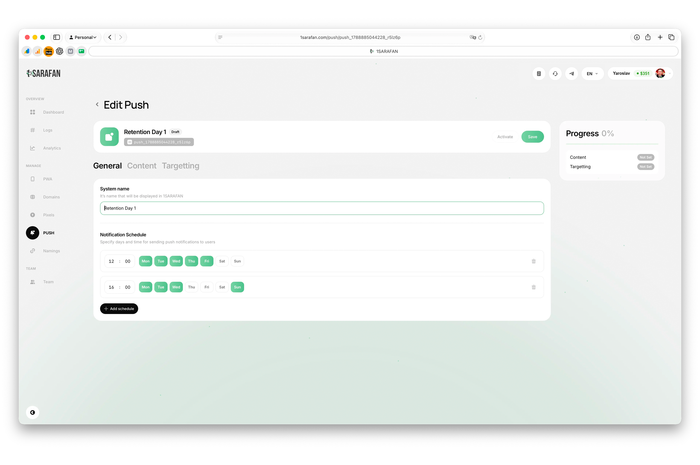
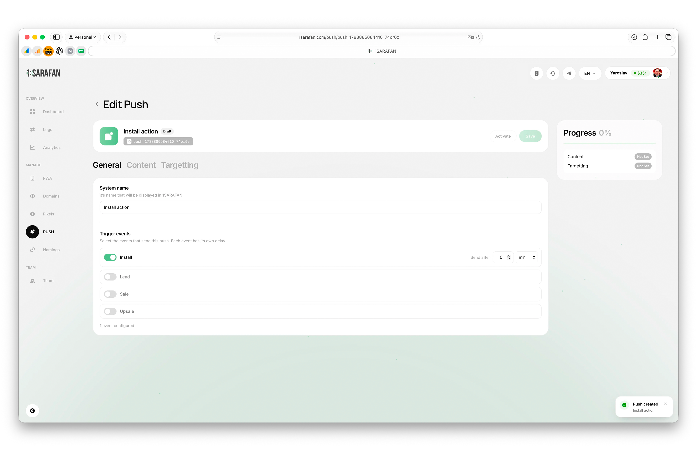
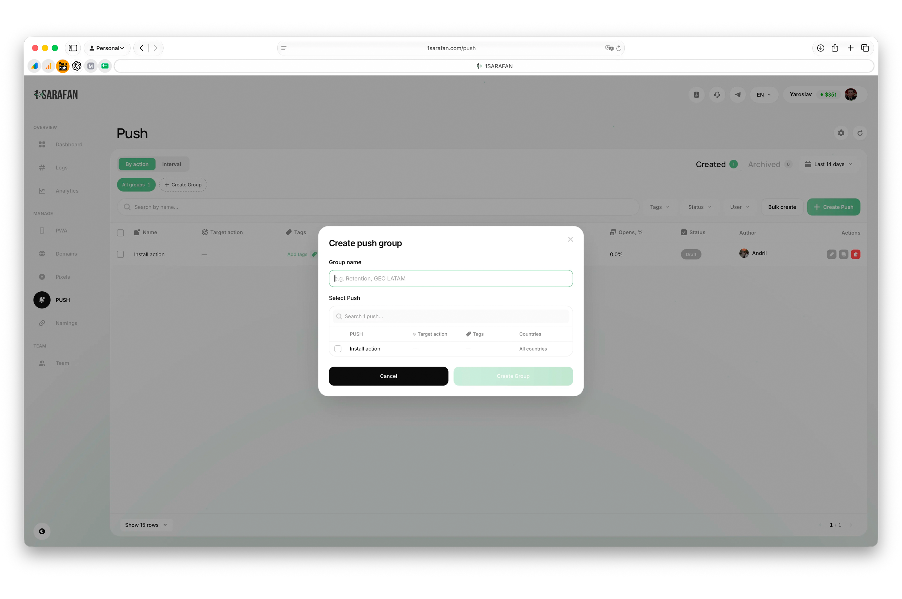

# Настройка пушей

Во вкладке **Push** можно выбрать два типа пушей: интервальные и по действию.\
Выбирай нужный раздел и создавай пуш по кнопке **Create Push**.

<figure><figcaption></figcaption></figure>

## Создание интервального пуша

При создании интервального пуша можно задать, в какие дни и в какое время он будет отправлен.

<figure><figcaption></figcaption></figure>

Во вкладке “Контент” можно задать:

* Заголовок — до 40 символов.
* Описание — до 150 символов.
* Язык.
* Изображение .

Во вкладке "Таргетинг" можно задать фильтры:

* PWA — по которым будет рассылка.
* Страны.
* Целевое событие.
  * Не прошел регистрацию.
  * Прошел регистрацию, но без депозита.
  * Регистрация + депозит.
  * Всем.
* SUB метки.

## Создание пуша по событию

Во вкладке "Основное" нужно выбрать, по какому событию будет отправляться инвайт:&#x20;

* Инсталл.
* Регистрация.
* Депозит.
* Повторный депозит.

А также время задержки перед отправкой.

<figure><figcaption></figcaption></figure>

Во вкладке "Таргетинг" можно задать фильтры:

* PWA.
* Страны.
* SUB метки.

> В тексте пушей можно использовать макросы. Подробнее про макросы [здесь](/broken/pages/zjESOWhQJJ001KLomLjJ).

**Важно**

Для корректной работы кастомных пушей, в настройках PWA должен быть выклчен тумблер на отправку "дефолтных" пушей.&#x20;

<figure><figcaption></figcaption></figure>

Также вы можете объединить пуши в единную группу для более быстрого подключения внутри PWA

<figure><figcaption></figcaption></figure>

<figure><figcaption></figcaption></figure>
