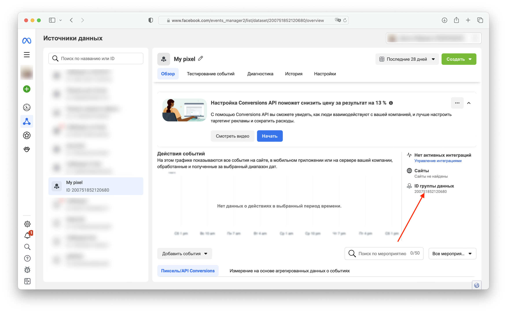
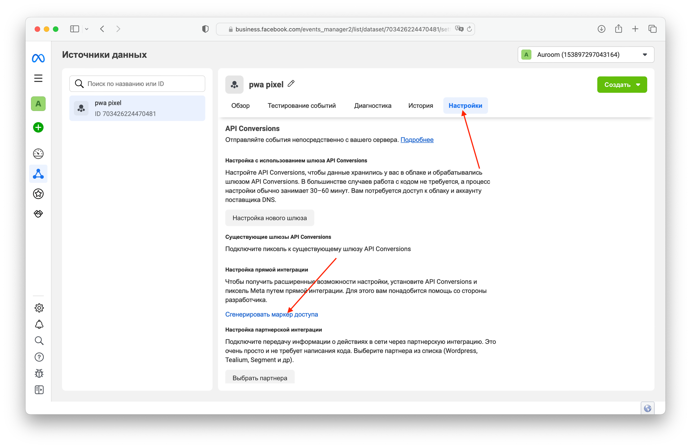
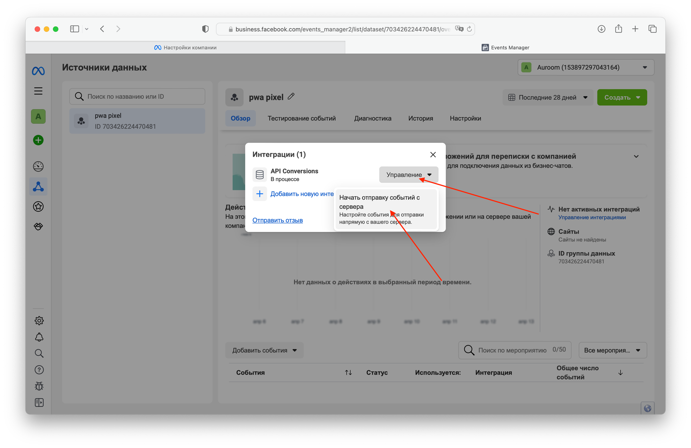
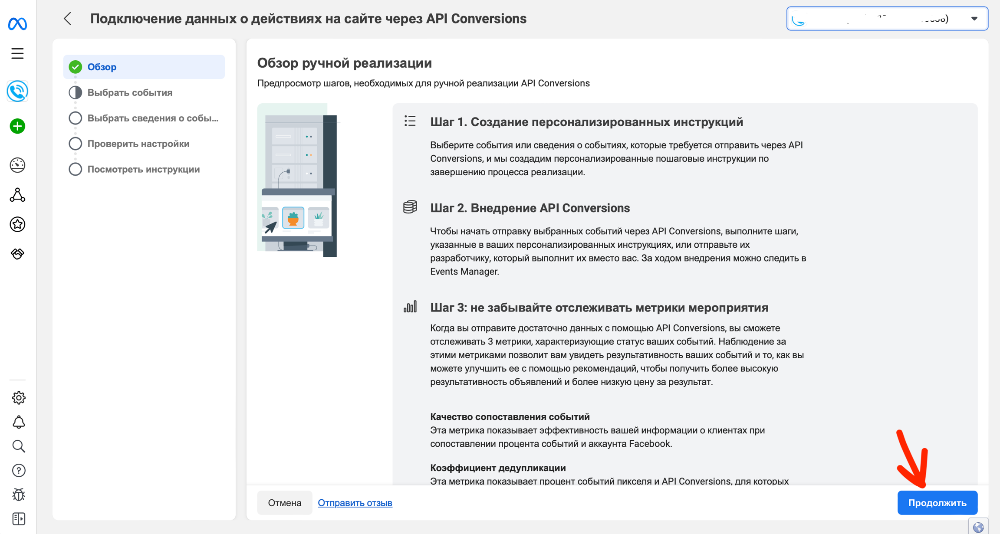
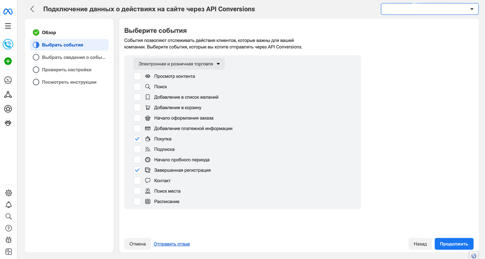
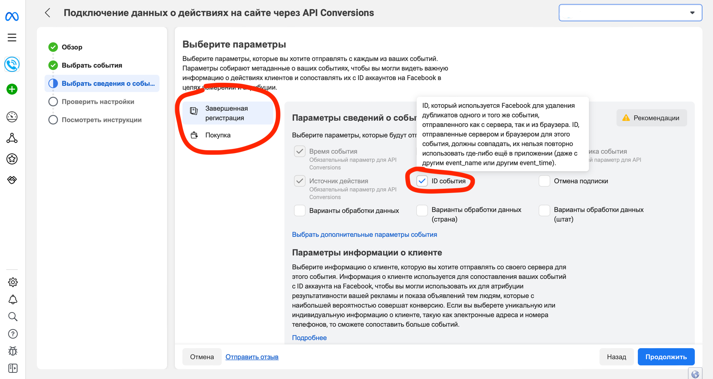
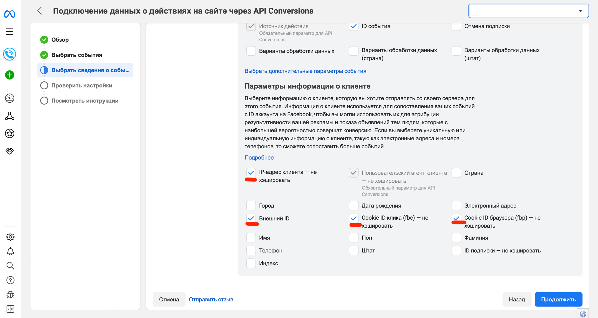
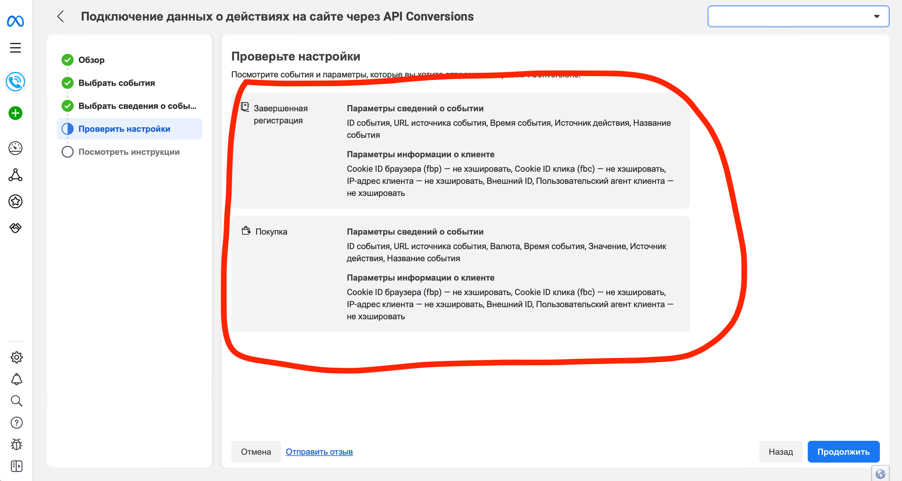

# Интеграция с FB

Интеграция нужна, чтобы передавать события (инсталлы, регистрации, депозиты) в пиксель FB через Conversions API для оптимизации рекламных кампаний.

## Что нужно для отправки событий?

1. ID пикселя.
2. Access Token для Conversion API.

## Где взять ID пикселя?

Идем в Events Manager, выбираем **Источники данных**, далее — нужный пиксель. Кликаем по ID группы данных. Это и есть нужный ID.

<figure><figcaption></figcaption></figure>

## Где взять токен и что настроить в FB?

Предполагаем, что у тебя уже есть БМ, где создан датасет (пиксель). Идем в **Events Manager**, в настройках пикселя создаем токен.

<figure><figcaption></figcaption></figure>

Либо на главной странице пикселя в **Events Manager** добавляем интеграцию через **Conversions API.**

<figure><figcaption></figcaption></figure>

<figure><figcaption></figcaption></figure>

На следующем шаге выбери события **Завершенная регистрация** и **Покупка.**

<figure><figcaption></figcaption></figure>

Для обоих событий выбери **ID события** в **Сведениях о событиях**.

<figure><figcaption></figcaption></figure>

В информации о клиенте выбери указанные параметры.

<figure><figcaption></figcaption></figure>

Проверь настройки на заключительном этапе.

<figure><figcaption></figcaption></figure>
