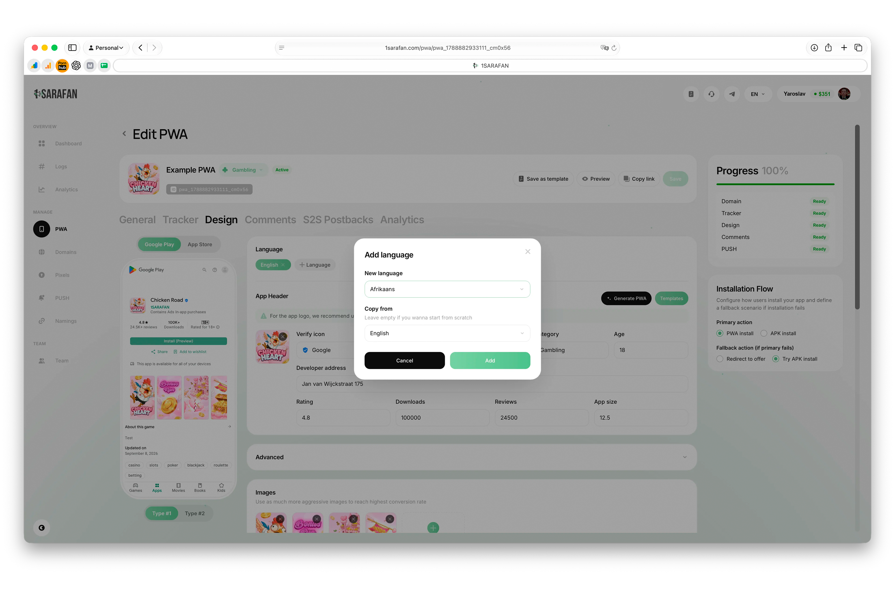

# Автоматический перевод PWA

## Как работает автоперевод PWA?

1SARAFAN автоматически переводит все системные надписи PWA на основной язык устройства пользователя — дополнительно ничего настраивать не нужно.

## Работает ли автоперевод для твоего текста?

Да, при добавлении нового языка можно выбрать, откуда скопировать текст для перевода.

<figure><figcaption></figcaption></figure>


**Полезно:** Чтобы не переносить все настройки вручную, в разделе **PWA** можно скопировать нужное приложение в один клик. Всё, что останется сделать — выбрать новый домен.

