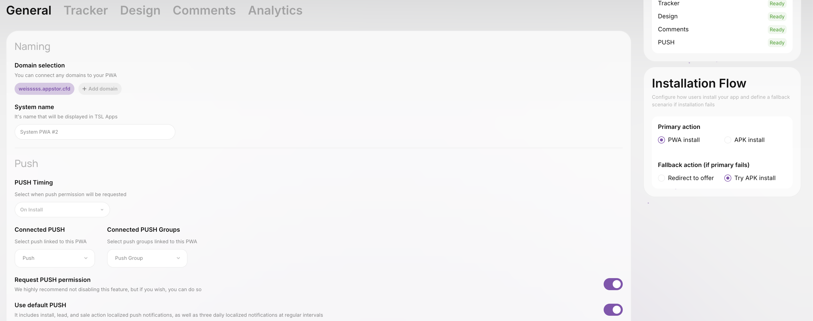

# Распределение IOS, PC, Android трафика

## iOS трафик

В отличие от Android, iOS трафик является более платежеспособным — ценность таких пользователей для рекламодателя или ПП выше.&#x20;

Даже при проливе на Android можно зацепить 3-5% iOS пользователей. На больших объёмах — это существенная упущенная выгода. Поэтому в TSL Apps мы реализовали решение, которое поможет не терять эти деньги.&#x20;

### Варианты работы с iOS

3 основных сценария:

1. Показать поп-ап (по кнопке Install или при открытии страницы).
2. Моментальный редирект на оффер.
3. Отправить пользователя на White Page.&#x20;
4. Отправить пользователя на приложение стороннего сервиса.

Мы рекомендуем выбирать первый пункт: только это флоу предполагает, что приложение будет установлено, и пользователь его не потеряет, в случае если у вас нет приложения.

<figure><figcaption>
Popup iOS
</figcaption></figure>

## PC трафик

В сравнении с iOS здесь всё намного проще, потому что PC имеют возможность инсталла PWA. Есть несколько вариантов:

1. Открыть PWA.
2. Моментальный редирект на оффер.
3. Отправить на White Page.

Для PC трафика мы рекомендуем использовать **редирект на оффер.**

## Android трафик

Во всех рекламных источниках имеются плейсменты, как и некоторые виды браузеров/телефонов, которые не поддерживают установку PWA, либо же ивент не успел дойти до устройства. В данном случае вы можете использовать:&#x20;

1. Показать поп-ап (по кнопке Install или при открытии страницы).
2. Предложить установку **apk.**&#x20;

**Также вы можете выбрать установку APK, как основной метод работы с трафиком.**&#x20;

<figure><figcaption></figcaption></figure>

## Где установить эти настройки?

В настройках PWA — раздел **Дополнительно.**
