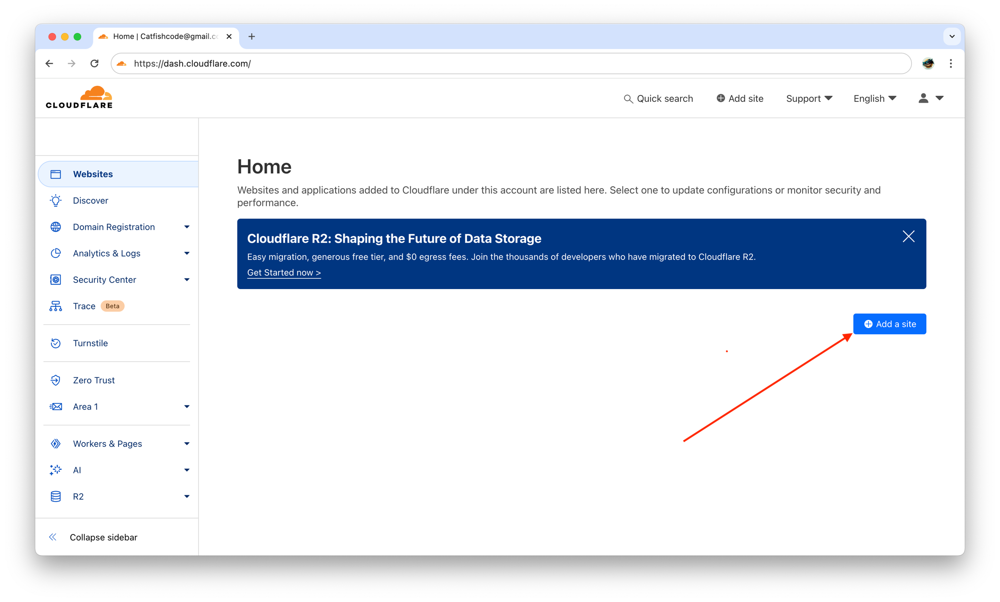
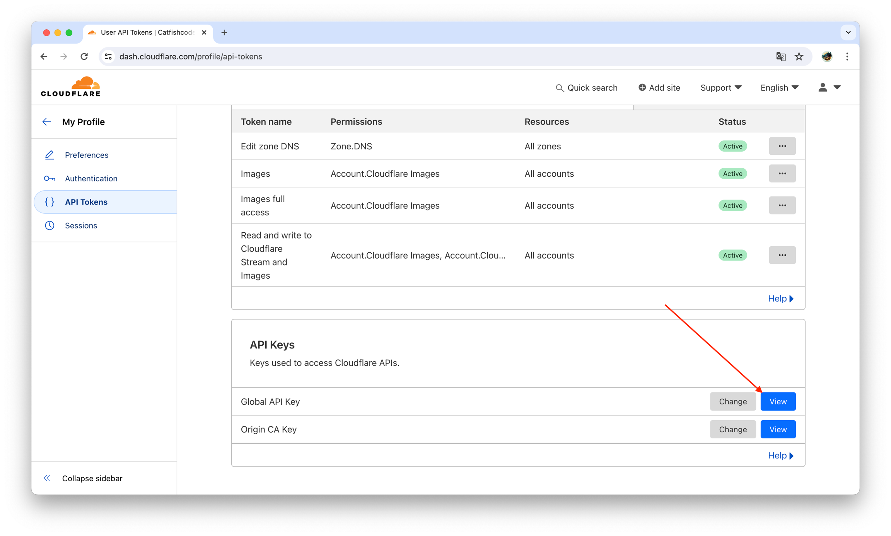
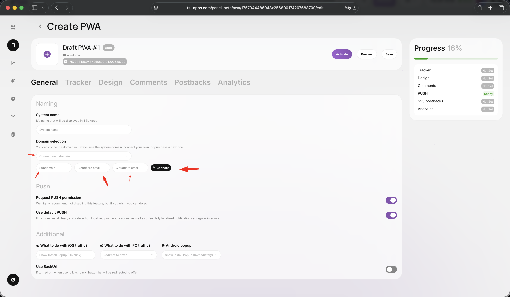

# Собственный домен

Чтобы настроить свой домен для работы с 1sarafan.com, нужно:

1. Передать управление DNS записями домена в CloudFlare.
2. Прописать в настройках API ключ, сам домен и E-mail аккаунта CloudFlare.
3. Добавить домен при создании PWA.

## Шаг 1. Как передать домен в CloudFlare

Для передачи домена под управление CloudFlare:

1. Создай аккаунт на сайте CloudFlare или войди в существующий на [https://dash.cloudflare.com/](https://dash.cloudflare.com/).
2. Нажми на кнопку "Add a site" и введи название домена.
3. После анализа сайта CloudFlare предложит список DNS-записей. Проверь их и при необходимости внеси изменения.
4. CloudFlare предоставит новые DNS-сервера. Зайди в панель управления домена у текущего регистратора и измени настройки DNS-серверов на предоставленные CloudFlare.
5. Подтверди изменения и дождись обновления DNS записей. Это может занять некоторое время (от нескольких минут до 24 часов).

После переноса управления DNS в CloudFlare можно настроить свой домен для работы с pwa.bot, следуя оставшимся указаниям.

<figure><figcaption></figcaption></figure>

## Шаг 2. Где взять API ключ CloudFlare?

Чтобы получить Global API Key от CloudFlare:

1. Войди в свой аккаунт на сайте CloudFlare на [https://dash.cloudflare.com](https://dash.cloudflare.com/).
2. Перейди в раздел "Profile" (Профиль) [https://dash.cloudflare.com/profile](https://dash.cloudflare.com/profile).
3. Выбери вкладку "API Tokens" (API Токены) [https://dash.cloudflare.com/profile/api-tokens](https://dash.cloudflare.com/profile/api-tokens).
4. Найди раздел "API Keys" (API Ключи) и нажми на "View" (Посмотреть) рядом с "Global API Key" (Глобальный API Ключ).
5. Введи пароль от аккаунта CloudFlare, чтобы подтвердить действие и отобразить Global API Key.

<figure><figcaption></figcaption></figure>

## Шаг 3. Подключение домена

При создании PWA выбери добавление домена и заполни все необходимые поля.

<figure><figcaption></figcaption></figure>

