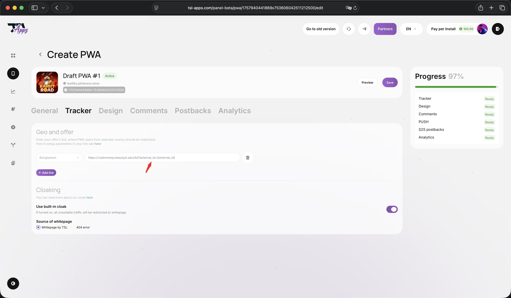

# Ссылка на оффер и click\_id

1sarafan.com позволяет передавать в трекер (Keitaro, Binom и т.д.) или ПП (партнёрскую программу) любые статические или динамические параметры. Самым важным из них является user\_id, который 1sarafan.com присваивает каждому уникальному пользователю.

## Для чего вообще передавать user\_id в ПП или трекер?

Для использования в постбеках, которые будут отправляться из трекера или ПП в 1sarafan.com. Без этого параметра не получится сметчить визит с событиями, которые произошли вне pwa.bot, т.е. с **Регистрациями** и **Депозитами**. Значит, и в FB (или другую рекламную сеть) события не будут корректно отстукиваться.

## Настройка передачи user\_id

Все трекеры и ПП имеют свой формат, в котором принимают внешний user\_id. Это можно посмотреть в документации или уточнить у менеджера. В Keitaro, например, он называется `external_id`, а в некоторых ПП — `subacc`, `sub` или `clickid`.

Во всех случаях логика одинаковая — нужно параметр к ссылке на оффер.&#x20;

```
key={user_id}
```

Вместо `key` нужно использовать название параметра ПП или трекера. Например, для Keitaro это будет выглядеть так:

```
external_id={user_id}
```

В интерфейсе это отображается примерно так:

<figure><figcaption></figcaption></figure>
