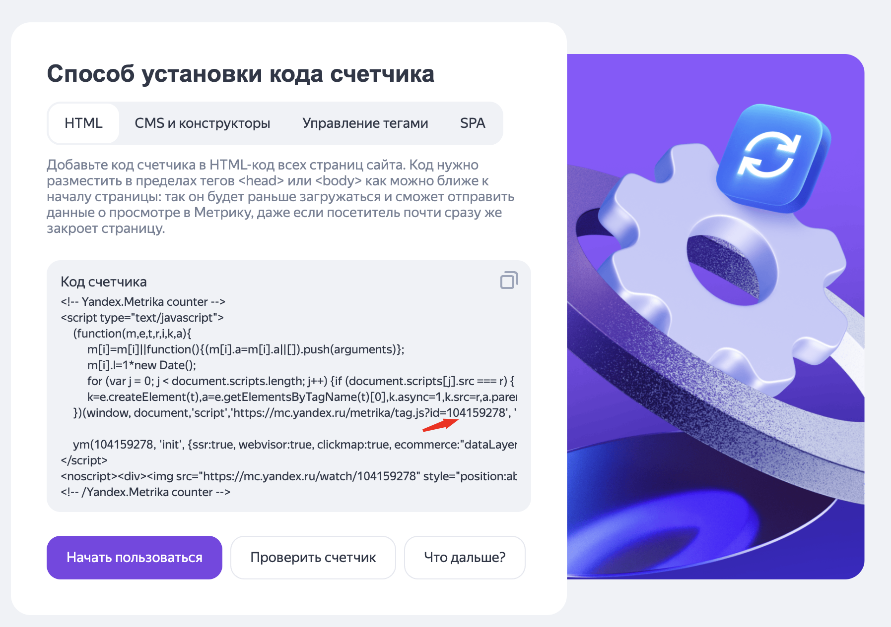

# Вебвизор в Яндекс.Метрике

Для создания Вебвизора нужно пройти регистрацию в сервисе Яндекс.Метрика: [https://metrika.yandex.ru](https://metrika.yandex.ru).

После успешной регистрации перейди на главный экран и нажми кнопку “Добавить счётчик”.\
Заполни поля:

* Название.
* Ссылка (без https://).

В блоке "Дополнительные настройки" включаем Вебвизор.

Блок “Заполнение профиля” можно заполнить по желанию.

В разделе “Способ установки кода счётчика” выбери “HTML”. Появится скрипт, в котором необходимо найти ID.

<figure><figcaption></figcaption></figure>

Копируем ID, переходим в редактирование PWA и открываем вкладку "Аналитика". В cursor id — вводим наш ID счётчика метрики и сохраняем. Далее нажимаем "Начать пользоваться".&#x20;

<figure><figcaption></figcaption></figure>
